# Software Licensing Knowledge Base

This knowledge base covers how software licenses work, where to obtain canonical license texts, the SPDX standard, and how package managers interact with licensing. Use the mind map below to navigate topics, or browse the linked files directly.

## Mind Map

```mermaid
mindmap
  root((Software Licensing))
    Fundamentals
      Copyright Basics
      Why a License File Is Required
      Common Mistakes
    License Types
      Permissive Licenses
      Copyleft Licenses
      Permissions Conditions Limitations
    License File Conventions
      File Naming and Location
      Copyright Line Formats
      Real-World Examples
    SPDX Standard
      Identifiers and Expressions
      Template Syntax
      Deprecated Identifiers
    License Text Sources
      SPDX License List Data
      GitHub Licenses API
      Other Sources
      Source Trust and Verification
    Package Managers
      License Field Formats
      Caching and Retrieval
```

## Topics

### Fundamentals

The legal foundation of software licensing and copyright.

- [Fundamentals](fundamentals.md) — overview of copyright law and licensing basics
- [Copyright Basics](copyright-basics.md) — the Berne Convention and automatic copyright
- [Why a License File Is Required](why-a-license-file-is-required.md) — why a LICENSE file matters even when a manifest declares one
- [Common Mistakes](common-mistakes.md) — frequent licensing errors developers make

### License Types

The spectrum of open-source licenses from permissive to copyleft.

- [License Types](license-types.md) — overview of the permissive vs. copyleft spectrum
- [Permissive Licenses](permissive-licenses.md) — MIT, Apache 2.0, BSD, ISC
- [Copyleft Licenses](copyleft-licenses.md) — GPL v2, GPL v3, LGPL, AGPL
- [Permissions, Conditions, and Limitations](permissions-conditions-limitations.md) — reference table across all licenses

### License File Conventions

How LICENSE files are structured, named, and customized in practice.

- [License File Conventions](license-file-conventions.md) — overview of file structure and placement
- [File Naming and Location](file-naming-and-location.md) — LICENSE vs. LICENSE.md vs. COPYING
- [Copyright Line Formats](copyright-line-formats.md) — year formats, holder name patterns
- [Real-World Examples](real-world-examples.md) — how React, Vue, Angular, and others do it

### SPDX Standard

The industry standard for license identification and templates.

- [SPDX Standard](spdx-standard.md) — overview of the SPDX specification
- [Identifiers and Expressions](identifiers-and-expressions.md) — simple IDs, versioned IDs, OR, WITH
- [Template Syntax](template-syntax.md) — the `<<var;...>>` variable format
- [Deprecated Identifiers](deprecated-identifiers.md) — superseded IDs and their replacements

### License Text Sources

Where to obtain authoritative, machine-readable license texts.

- [License Text Sources](license-text-sources.md) — overview and comparison of sources
- [SPDX License List Data](spdx-license-list-data.md) — the official spdx/license-list-data repository
- [GitHub Licenses API](github-licenses-api.md) — REST API endpoints and response format
- [Other Sources](other-sources.md) — choosealicense.com and OSI license pages
- [Source Trust and Verification](source-trust-and-verification.md) — why these sources are trustworthy

### Package Managers

How different ecosystems declare and consume license metadata.

- [Package Managers](package-managers.md) — overview of license fields across ecosystems
- [License Field Formats](license-field-formats.md) — npm, Composer, Cargo, pyproject.toml
- [Caching and Retrieval](caching-and-retrieval.md) — fetching, caching, and fallback strategies
